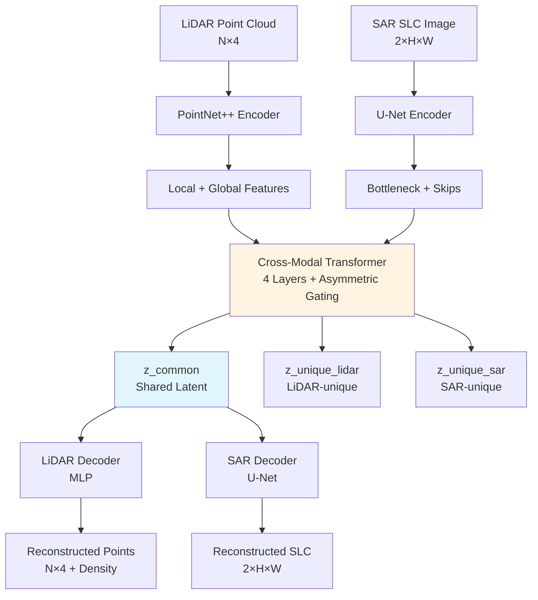

# LiDAR-SAR Multimodal Foundation Model

Self-supervised foundation model for fusing LiDAR point clouds with SAR backscatter imagery.

## Architecture



## Training Command

```bash
# Single GPU
python train.py --config config.yaml

# Multi-GPU with DDP
torchrun --nproc_per_node=4 train.py --config config.yaml
```

## Downstream Evaluation

```bash
# Linear probe evaluation
python downstream_eval.py --config config.yaml
```

## Dataset Format

Expected HDF5 format:

```hdf5
/lidar_points: (N, 4)  # x, y, z, intensity
/sar_slc: (2, H, W)    # amplitude, phase
/labels: (optional)     # class label for downstream tasks
```

## Model Specifications

- **Latent Dimension**: 256 (configurable)
- **LiDAR Branch**: PointNet++ with KNN (k=16)
- **SAR Branch**: 4-level U-Net with residual connections
- **Fusion**: 4-layer Transformer with cross-attention
- **Total Parameters**: ~30M (target <50M)

## Self-Supervised Objectives

1. **Cross-modal MAE**: Mask 75% LiDAR points, 60% SAR patches
2. **Contrastive Alignment**: InfoNCE with temperature τ=0.07
3. **Decoupled Representation**: DeCUR adversarial discriminator
4. **Reconstruction**: L1 + Chamfer (LiDAR), L1 + angular (SAR)

## Requirements

```
torch>=2.1.0
torchvision
torch-geometric
omegaconf
wandb
h5py
scikit-learn
```

## License

MIT
